# Google Drive Plugin

This plugin provides a read / write connector to interact with documents stored on [GoogleDrive](https://drive.google.com).

## How to use

In order to use the plugin, you will need service account's credentials exported in a JSON file with the Drive API enabled.

1. From the [Google service account tab](https://console.developers.google.com/iam-admin/serviceaccounts), create a new project (Select a project > New Project).

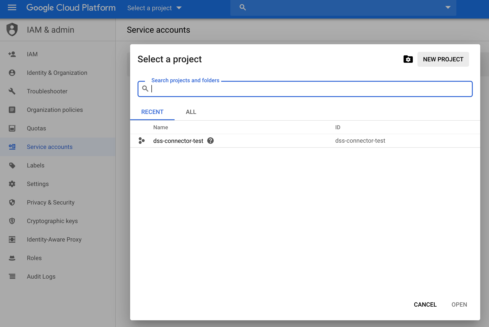

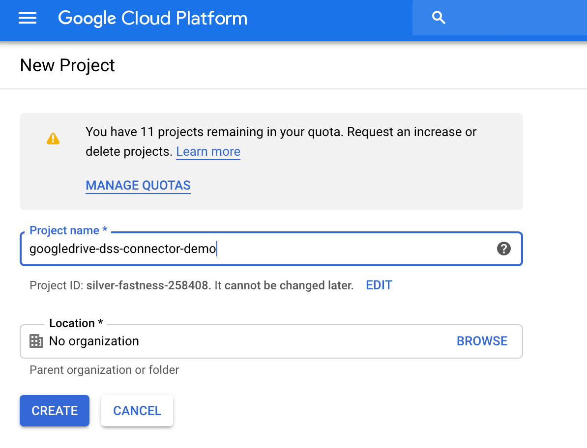

2. Create a service account for that project

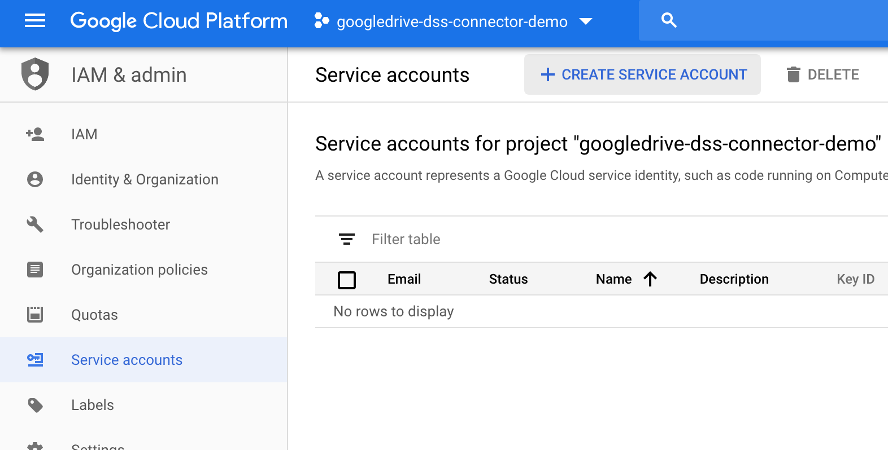

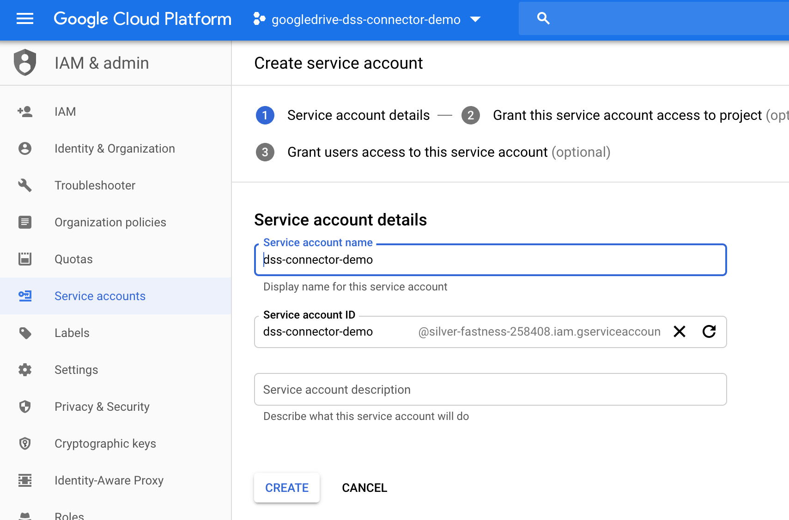

3. Create a key, use the JSON format

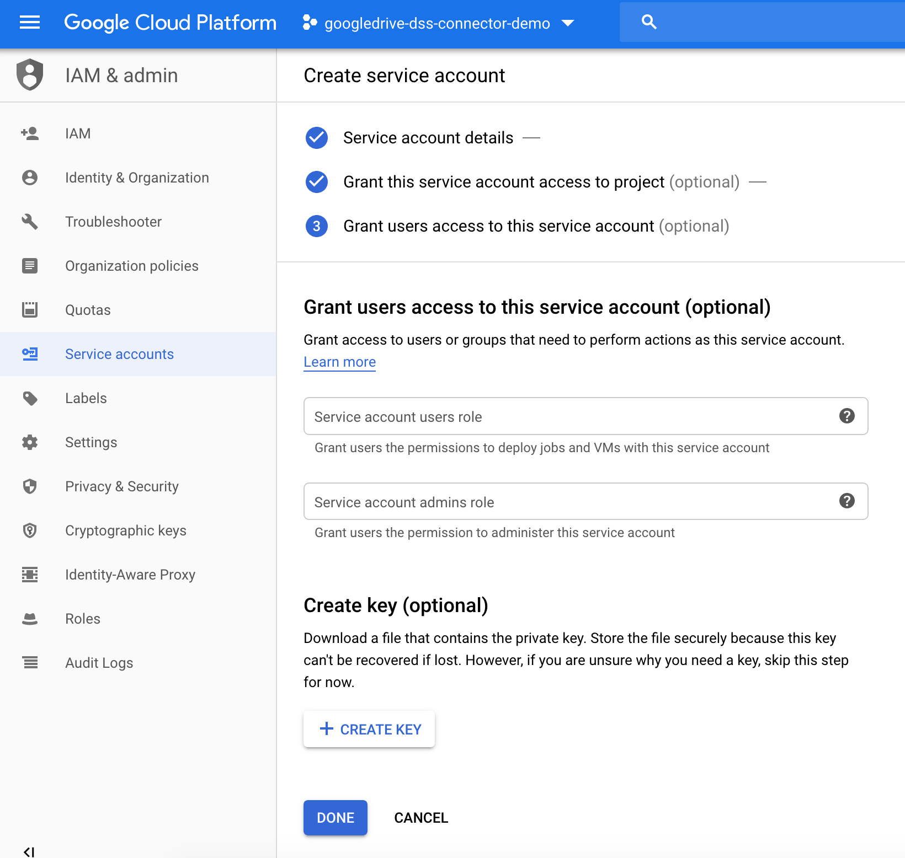

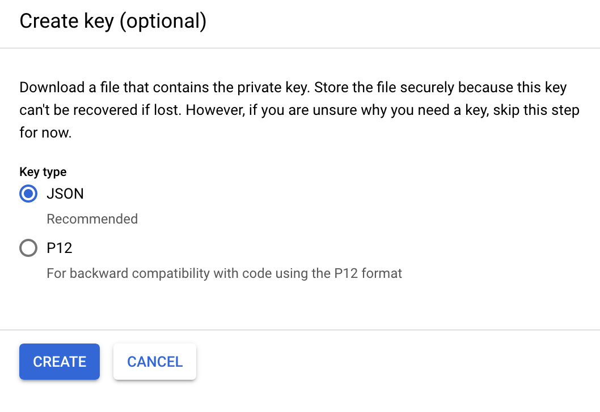

4. Save the key and open it with a text editor, and press `Done`. Note the service account's email address for later use.

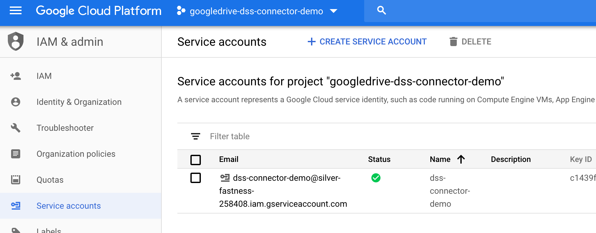

5. Enable the [Google Drive API](https://console.developers.google.com/apis/library/drive.googleapis.com) for your project.

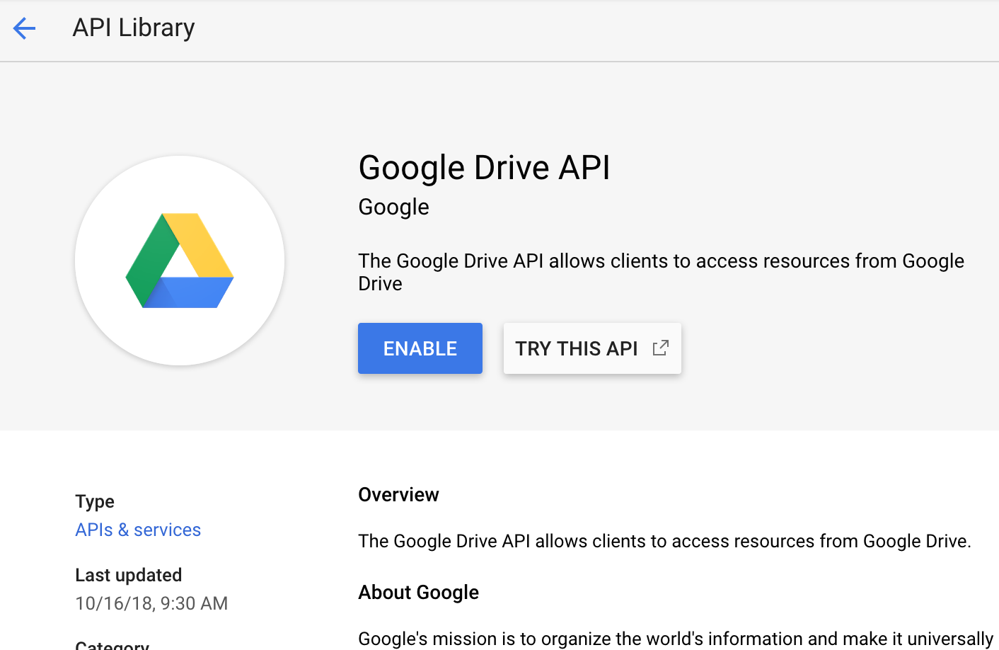

6. Go to the plugin's setting page (DSS > Plugins > Googledrive > Settings > Google Drive connection) and add a preset. In the `Access credentials` box, paste the service account key copied from step 4.

## How to use

- First, share the Google Drive document or directory with the service account email address copied from step 4.

- Take note of the directory ID, which is the last part of the URL

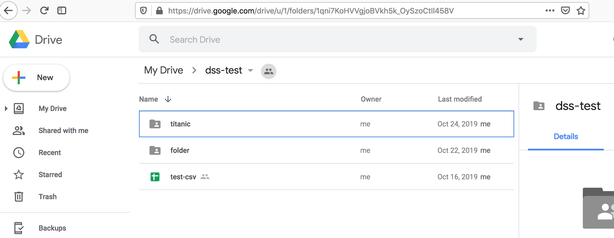

- In your DSS project flow, select **Dataset > Googledrive**

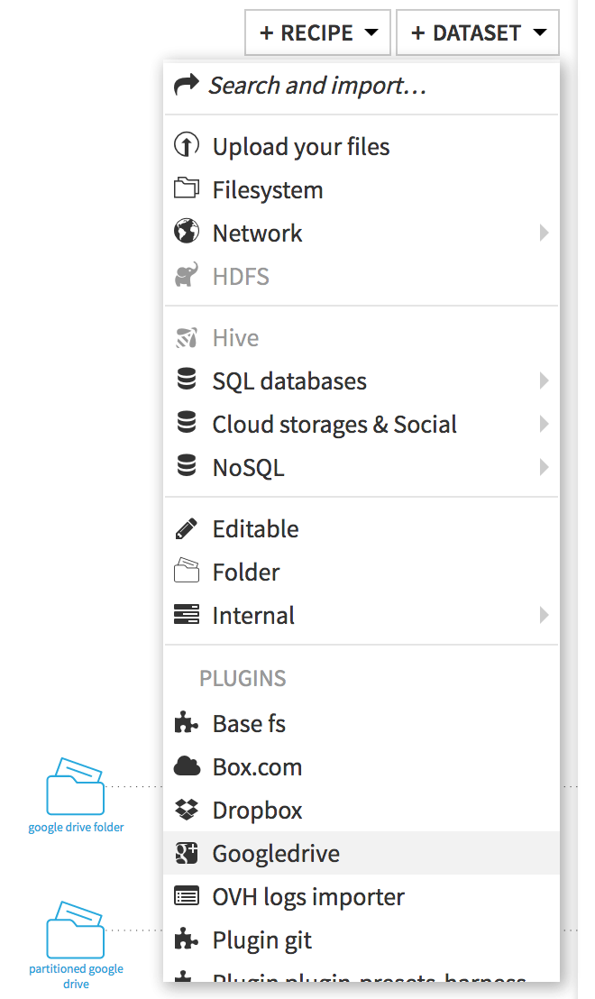

- Click Googledrive Filesystem
- Pick the right preset, and In *ID of root directory*, paste the previously copied directory ID

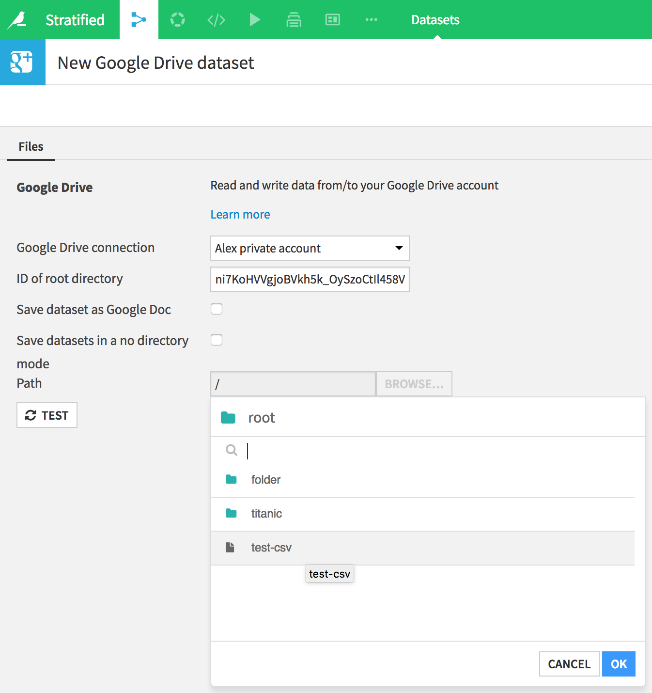

## Write mode

- Edit the `DATADIR/config/dip.properties` file and add the following key: `dku.datasets.external.no_connection.allowClear=true`
- Share an empty directory with the Google Drive service account. It is important that it does not contain data you want to keep: **the entire structure contained inside this directory can be deleted by the plugin**.
- In the flow, first create your target Google Drive dataset, by selecting the Googledrive plugin in the dataset list.
- Browse to your target directory, name this new dataset and press **create**
- If the following message appears : `An invalid argument has been encountered : Missing parameters for CSV` got to the dataset *Settings > Format / Preview* and set *Quoting style*

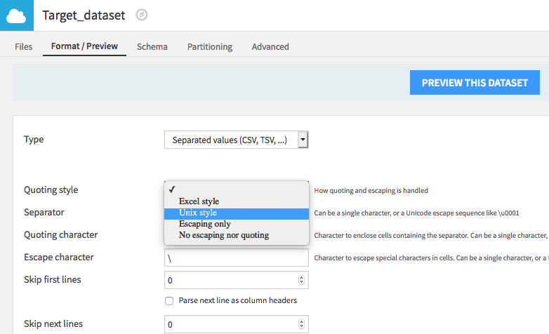

- Pick the source dataset and create a sync recipe from it. Select *Use existing dataset* and pick your target Googledrive dataset. Finally **Create recipe**.

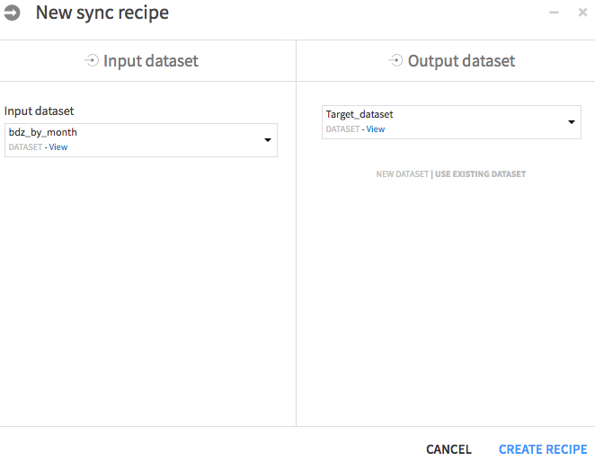
